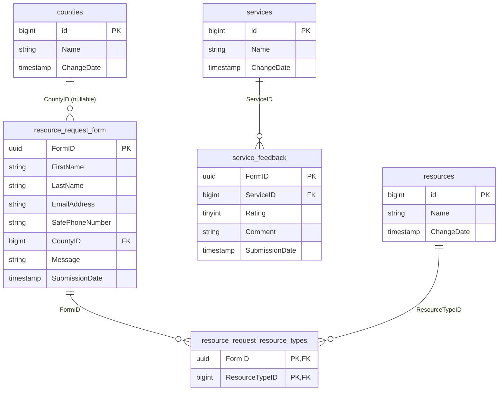
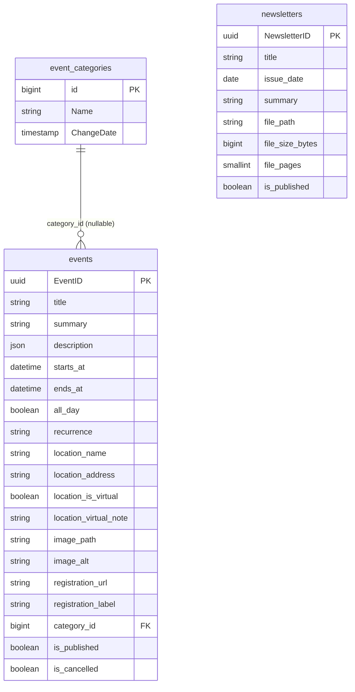

# HarborSafe Portal Schema — Reference

Human-readable view of the app's MySQL connections (`Portal` and `Feedback`), generated because migration PHP files don't give a good at-a-glance picture of the schema. Regenerate with the `SHOW CREATE TABLE` query documented in `CLAUDE.md` after future migrations. The `Portal` section was originally compared against `Original_Schema_design.md` (the pre-build design doc) — see the gap analysis below it for what changed and why.

**Migration bookkeeping:** always run `php artisan migrate --database=Portal`, regardless of which connection a given migration actually targets via its own `Schema::connection(...)` call. Portal's `migrations` table is this project's single canonical ledger. Running `migrate --database=Feedback` (or any other) against a database whose own `migrations` table is empty makes Laravel try to replay the *entire* migration history into it, not just the ones meant for that database — hit and fixed once already while building the `Feedback` schema.

## Portal connection — current live schema

```mermaid
erDiagram
    users {
        bigint id PK
        string name
        string email
        string password
        string role "law_enforcement / secretary / admin"
        bool is_active
        text two_factor_secret
        text two_factor_recovery_codes
    }
    agencies {
        bigint id PK
        string name
    }
    law_enforcement_agents {
        bigint user_id PK_FK
        string badge_number
        bigint agency_id FK
    }
    law_enforcement_assessment {
        uuid DocumentID PK
        timestamp DateCreated
        bigint submitted_by FK
        string OffenderFirstName
        string OffenderLastName
        string OffenderSex
        date OffenderDOB
        string OffenderVictimRelationship
        string VictimFirstName
        string VictimLastName
        string VictimSex
        date VictimDOB
        string VictimSafePhoneNumber
        uuid AssessmentDocID FK
    }
    assessment_change_log {
        uuid ChangeLogID PK
        uuid DocumentID FK
        string ChangeField
        string PreviousValue
        string NewValue
        bigint ChangedBy FK
        timestamp TimeStamp
    }
    assessment_answer_change_log {
        uuid LogID PK
        uuid AssessmentDocID FK
        string ChangeField
        bool PreviousValue
        bool NewValue
        bigint ChangedBy FK
        timestamp TimeStamp
    }
    _assessment_answers {
        uuid AssessmentDocID PK
        bool RiskIndicator1
        bool RiskIndicator2
        bool RiskIndicator3
        bool RiskIndicator4
        bool RiskIndicator5
        bool RiskIndicator6
        bool RiskIndicator7
        bool RiskIndicator8
        bool RiskIndicator9
        bool RiskIndicator10
        bool RiskIndicator11
    }
    _submitter_info {
        uuid SubmissionID PK
        string SubmitterEmail
        string SubmitterPhoneNumber
        string SubmitterFirstName
        string SubmitterLastName
    }
    _private_assessment {
        uuid DocumentID PK
        timestamp DateCreated
        string OffenderFirstName
        string OffenderLastName
        string OffenderSex
        date OffenderDOB
        string OffenderVictimRelationship
        string VictimFirstName
        string VictimLastName
        string VictimSex
        date VictimDOB
        string VictimSafePhoneNumber
        uuid SubmissionID FK
        uuid AssessmentDocID FK
    }

    users ||--o| law_enforcement_agents : "1:1, law_enforcement accounts only"
    law_enforcement_agents }o--o| agencies : "agency_id"
    users ||--o{ law_enforcement_assessment : "submitted_by"
    law_enforcement_assessment }o--|| _assessment_answers : "AssessmentDocID"
    law_enforcement_assessment ||--o{ assessment_change_log : "DocumentID"
    _assessment_answers ||--o{ assessment_answer_change_log : "AssessmentDocID"
    _private_assessment }o--|| _assessment_answers : "AssessmentDocID"
    _private_assessment }o--o| _submitter_info : "SubmissionID (nullable = anonymous)"
```

Framework/Sanctum tables also present but not shown above (no app-specific structure worth diagramming): `sessions`, `cache`, `cache_locks`, `jobs`, `job_batches`, `failed_jobs`, `migrations`, `password_reset_tokens`, `personal_access_tokens`.

### Table detail

| Table | Purpose | Key columns | Notes |
|---|---|---|---|
| `users` | Every account, any role | `id` (PK), `role`, `is_active` | `role` is a native PHP enum (`App\Enums\UserRole`) cast, not a raw string comparison. Two-factor columns are Fortify-compatible and currently unused (login not built yet). |
| `agencies` | Lookup table for law-enforcement agency types | `id` (PK), `name` | |
| `law_enforcement_agents` | Badge/agency data, only for `role = law_enforcement` accounts | `user_id` (PK, FK → `users.id`) | 1:1 profile extension — secretary/admin accounts simply have no row here, rather than null columns on `users`. |
| `law_enforcement_assessment` | LE-submitted offender/victim record | `DocumentID` (PK, uuid), `submitted_by` (FK → `users.id`, not nullable) | `submitted_by` is the ownership column — this is what will make "law enforcement sees only their own submissions" enforceable once policies are built. |
| `assessment_change_log` | Audit trail for edits to `law_enforcement_assessment` | `ChangeLogID` (PK), `DocumentID` (FK), `ChangedBy` (FK → `users.id`) | |
| `assessment_answer_change_log` | Audit trail for edits to `_assessment_answers` | `LogID` (PK), `AssessmentDocID` (FK), `ChangedBy` (FK → `users.id`) | |
| `_assessment_answers` | The 11-question risk-indicator answers | `AssessmentDocID` (PK, uuid) | Shared by both `law_enforcement_assessment` and `_private_assessment` |
| `_submitter_info` | Optional submitter contact info for public/anonymous submissions | `SubmissionID` (PK, uuid) | |
| `_private_assessment` | Public/anonymous-capable offender/victim record | `DocumentID` (PK, uuid), `SubmissionID` (FK, nullable) | No `submitted_by` — there's no authenticated account behind a public submission. Unchanged by the schema-completion pass. |

**Connections:** every table above lives on the `Portal` MySQL connection (see `config/database.php`), including `users` — this was a discovered inconsistency (the default `mariadb` connection is what `users`/`sessions`/etc. were originally intended for, but migrations were actually run with `--database=Portal`). `App\Models\User` now explicitly declares `protected $connection = 'Portal'` to match reality.

---

## Feedback connection — current live schema

Backs the website's two public forms (service feedback, resource request) plus their lookup tables. Physically a separate database (`feedback_app_db`) from `Portal`.



### Table detail

| Table | Purpose | Key columns | Notes |
|---|---|---|---|
| `services` | Lookup table for the service-feedback form | `id` (PK) | |
| `resources` | Lookup table for the resource-request form | `id` (PK) | |
| `counties` | Lookup table for the resource-request form | `id` (PK) | |
| `service_feedback` | Public service-rating submissions | `FormID` (PK, uuid), `ServiceID` (FK, required) | `Rating`'s 1–5 range is enforced in validation, not a DB constraint, matching how the rest of the app handles range checks. |
| `resource_request_form` | Public resource-request submissions | `FormID` (PK, uuid) | `LastName`, `CountyID`, `Message` are all nullable (optional on the form); `FirstName` is required. `EmailAddress`/`SafePhoneNumber` are each nullable, but the form requires at least one of the two (`required_without` on both, enforced in `ResourceRequestStoreRequest`) so there's always a way to reach the submitter back. `FirstName`/`LastName` are `varchar(50)` — shrunk from an original 100 to match what validation and the form input actually accept end-to-end. `SafePhoneNumber` is a string column, not numeric — an int would drop leading zeros and can't hold formatting. |
| `resource_request_resource_types` | Junction table for the form's multi-select "resources of interest" field | `FormID` (FK), `ResourceTypeID` (FK), composite PK on both | Replaced an earlier singular `ResourceTypeID` FK column directly on `resource_request_form`, which couldn't represent more than one selection. |

### Two connections, one database — how "write-only" is enforced

`config/database.php` defines **two** Laravel connections against the same physical `feedback_app_db`:

- **`Feedback`** — full access. Used by the Eloquent models above, and by the portal-side admin/secretary read/export functionality once it's built.
- **`FeedbackPublic`** — a second connection meant for a *restricted* MySQL user, for the public website's submission endpoints once they're built. This is what makes "the website only ever has write access" a real, database-enforced guarantee rather than an assumption baked into application code.

The restricted user needs exactly this, and nothing more:

```sql
-- Replace CHANGE_ME with a strong, generated password. Scope the host
-- portion (currently '%') to the actual application server in production
-- rather than allowing any host.
CREATE USER 'harborsafe_feedback_public'@'%' IDENTIFIED BY 'CHANGE_ME';

GRANT INSERT ON feedback_app_db.service_feedback TO 'harborsafe_feedback_public'@'%';
GRANT INSERT ON feedback_app_db.resource_request_form TO 'harborsafe_feedback_public'@'%';
GRANT INSERT ON feedback_app_db.resource_request_resource_types TO 'harborsafe_feedback_public'@'%';
GRANT SELECT ON feedback_app_db.services TO 'harborsafe_feedback_public'@'%';
GRANT SELECT ON feedback_app_db.resources TO 'harborsafe_feedback_public'@'%';
GRANT SELECT ON feedback_app_db.counties TO 'harborsafe_feedback_public'@'%';

FLUSH PRIVILEGES;
```

Note what's deliberately *not* granted: no `SELECT` on `service_feedback`/`resource_request_form`/`resource_request_resource_types` (the website can never read back a submission — only secretary/admin, via the `Feedback` connection, will be able to), and no access of any kind to the `Portal` database. Once created, put the credentials in `DB_USERNAME_FEEDBACK_PUBLIC`/`DB_PASSWORD_FEEDBACK_PUBLIC`.

**The `resource_request_resource_types` grant is new** (added alongside the migration that created the table) — any environment where the `harborsafe_feedback_public` user was already created before this needs that one `GRANT INSERT` statement run against it manually; migrations can't grant MySQL privileges themselves.

The public submission controllers (`ServiceFeedbackController`, `ResourceRequestFormController`) are built and live at `POST /api/public/service-feedback` / `POST /api/public/resource-requests` — both use `FeedbackPublic` and explicitly `DB::disconnect('FeedbackPublic')` after each write. Input validation for both lives in `app/Http/Requests/Public/` (`ServiceFeedbackStoreRequest`, `ResourceRequestStoreRequest`).

---

## Content connection — migrations written, not yet applied anywhere

Backs the website's Events & News page. Physically a separate database from both `Portal` and `Feedback`. **The migrations exist (`2026_09_24_100000`–`2026_09_24_100200`) but have not been run in any environment yet** — the tables below describe what they create, not what is live.



### Table detail

| Table | Purpose | Key columns | Notes |
|---|---|---|---|
| `event_categories` | Lookup for the events page's category badge | `id` (PK) | Same shape as the `services`/`resources`/`counties` lookups. Seeded with the five values the page was built against (`EventCategorySeeder`). The public endpoint must serialize `Name`, never `category_id` — the site renders the category as a plain string. |
| `events` | Events shown on the public Events & News page | `EventID` (PK, uuid), `category_id` (FK, nullable) | Columns derived from `website/frontend/src/app/lib/mock-events.json`, which this table replaces. The mock's nested `location`/`image`/`registration` objects are flattened here and rebuilt by the API resource. `description` is a **JSON array of paragraph strings**, not HTML — the page does `description.map(...)`. `is_published` and `is_cancelled` are independent flags, not one status: a published event can also be cancelled. Indexed on `(is_published, starts_at)` to match the public endpoint's filter and sort. |
| `newsletters` | Newsletter issues on the same page | `NewsletterID` (PK, uuid) | `file_size_bytes`/`file_pages` are nullable and stored rather than derived, so listing issues doesn't require stat-ing every object in the bucket. Indexed on `(is_published, issue_date)`. |

**Times are stored UTC.** The site formats in `America/New_York` (`TIME_ZONE` in `website/frontend/src/app/lib/content.js`) and the source data carries offsets that shift with DST (`-05:00` in January, `-04:00` in March). The staff panel must convert on the way in — writing a naive wall-clock value straight into `starts_at` puts every DST-straddling event an hour off.

**`image_path` and `file_path` are object-storage keys, not URLs.** Uploads go to S3 (`league/flysystem-aws-s3-v3`); the API resource turns the key into the absolute URL the site expects at `image.src` / `file.url`. Whether that is a public URL or an expiring signed one depends on the still-open public-vs-private decision in `Filament_CMS_Design.md` §6.6.

### `ContentPublic` — the read-only half

As with `Feedback`/`FeedbackPublic`, `config/database.php` defines two connections against the same physical database:

- **`Content`** — full access. Used by the Filament staff panel and the Eloquent models.
- **`ContentPublic`** — a restricted, **SELECT-only** MySQL user for the website's read endpoints. Content is added, changed and deleted exclusively from the staff panel, so this user gets no write privilege of any kind.

```sql
-- Replace CHANGE_ME with a strong, generated password. Scope the host
-- portion (currently '%') to the actual application server in production
-- rather than allowing any host.
CREATE USER 'harborsafe_content_public'@'%' IDENTIFIED BY 'CHANGE_ME';

GRANT SELECT ON content_db.events           TO 'harborsafe_content_public'@'%';
GRANT SELECT ON content_db.newsletters      TO 'harborsafe_content_public'@'%';
GRANT SELECT ON content_db.event_categories TO 'harborsafe_content_public'@'%';

FLUSH PRIVILEGES;
```

Note what is deliberately *not* granted: no `INSERT`, `UPDATE` or `DELETE` on anything, and no access of any kind to `Portal` or the feedback database. Once created, put the credentials in `DB_USERNAME_CONTENT_PUBLIC`/`DB_PASSWORD_CONTENT_PUBLIC`. Substitute the real database name for `content_db` — it comes from `DB_DATABASE_CONTENT`.

Like the `FeedbackPublic` grants, these have to be run by hand against each environment — migrations can't grant MySQL privileges.

---

## Gap analysis vs. `Original_Schema_design.md` — resolved (Portal connection)

| Original table | Status | What was built |
|---|---|---|
| `tblAssessmentAnswers` | ✅ Built (`_assessment_answers`) | Matches almost field-for-field |
| `tblPrivateAssessment` | ✅ Built (`_private_assessment`) | Submitter fields split into `_submitter_info` per the original design's own note; `IncidentCounty` intentionally not added (dropped per client request) |
| `tblLawEnforcementAssessment` | ✅ Built (`law_enforcement_assessment`), as its own table | Kept separate from `_private_assessment` per your call. Uses `submitted_by` (FK → `users.id`) instead of the original's inline `SubmitterEmail`, since real accounts now exist. No Incident fields (same client decision). |
| `tblUserCredentials` | ✅ Superseded by `users` | Kept Laravel's auto-increment `id` rather than the original's email-as-PK design (Sanctum/Eloquent convention); added a 3-value `role` enum instead of the original's binary `Admin` boolean, since `secretary` was added to the requirements after the original doc was written. |
| `tblLawEnforcementAgents` | ✅ Built (`law_enforcement_agents`) | Kept as its own table per your call, rather than folding badge/agency into `users` — avoids null columns on non-law-enforcement accounts. Keyed by `user_id` instead of email. |
| `tblAgency` | ✅ Built (`agencies`) | Added a `name` column — the original design was a bare UUID primary key with no label, which wouldn't function as a usable lookup table. |
| `tblAssessmentChangeLog` | ✅ Built (`assessment_change_log`) | Scoped to `law_enforcement_assessment` only (not the public/anonymous `_private_assessment` — no authenticated editor exists for those records). `ChangedBy` is a real FK to `users.id` instead of a loose string. Dropped the original's `AssessmentChange` boolean column (unclear purpose). Fixed an apparent mislabeling: the original called its record-reference column `AssessmentDocID`, but it clearly meant the assessment's own document id, not `_assessment_answers`' key — renamed to `DocumentID` here. |
| `tblAssessmentAnswerChangeLog` | ✅ Built (`assessment_answer_change_log`) | Scoped to `_assessment_answers`. Same `ChangedBy` FK treatment. |

### Naming drift (cosmetic, not functional)
- `OffenderRelationship` (original) → `OffenderVictimRelationship` (current, both tables) — same field, clarified name.
- The three original tables carry a leading underscore (`_assessment_answers`, `_private_assessment`, `_submitter_info`) for reasons lost to history; the five tables added in this pass use plain snake_case instead of propagating that convention. Normalizing all of them to one style is a possible future cleanup, not done here.

### Requirements captured in the original design notes — not yet implemented (this was a schema-only pass)
- Password policy: minimum 15 characters, maximum 64, checked against a common-password list — this is application-layer validation, not a schema concern; the `password` column already comfortably fits any hash Laravel produces.
- Two-factor authentication — the `users` table now has Fortify-compatible columns for this, but no 2FA logic exists yet.
- Authorization rule (admins see everything, law-enforcement see only their own) — the schema now has what's needed to enforce this (`submitted_by`), but no policies/middleware exist yet. That's the next phase: building the actual login flow, not schema.
